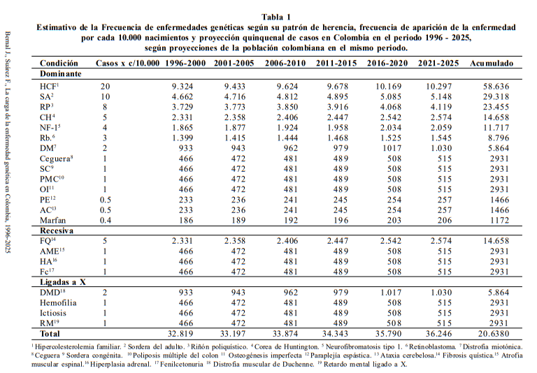
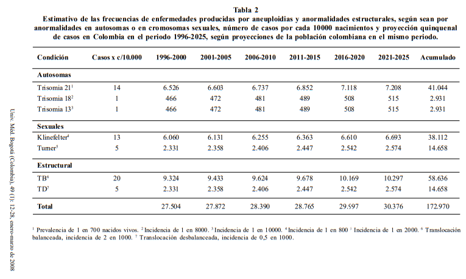
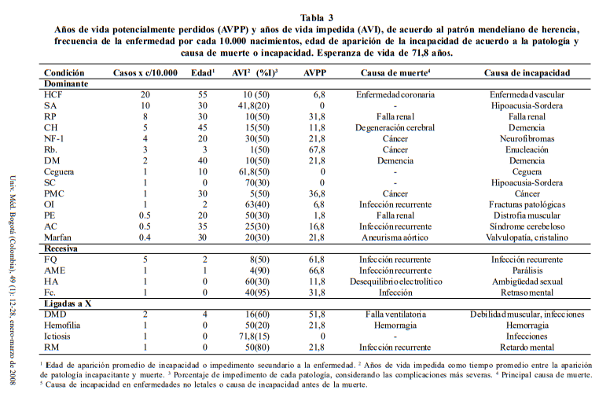
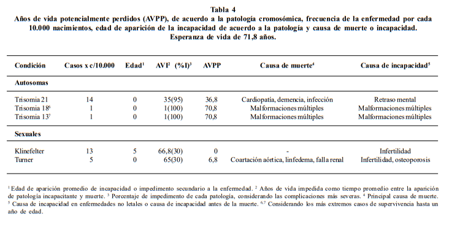

# Aplicación del Algoritmo Deutsch-Jozsa en el Diagnóstico Rápido de Enfermedades Genéticas en Colombia mediante Computación Cuántica

## Análisis del Problema

Colombia, con una población de 43,7 millones de habitantes y una esperanza de vida de 71,8 años, enfrenta desafíos en salud pública asociados a su transición epidemiológica. A pesar de ser clasificado como un país de ingreso medio-bajo por el Banco Mundial (PIB de US\$80.900 millones), ha logrado avances socioeconómicos y en salud en las últimas décadas, aunque persisten desigualdades [1, 2].

El mejoramiento en el control de infecciones y la atención materno-infantil ha hecho más visibles las enfermedades genéticas y malformaciones congénitas como causas de morbilidad y mortalidad [2]. Este estudio busca cuantificar su impacto mediante métricas como años de vida potencialmente perdidos (AVPP) y años de vida sana perdidos (AVISA), con el fin de orientar políticas públicas [1].  
Se analizaron datos demográficos del DANE [7] y registros de salud desde 1993 (tras la reforma al sistema de seguridad [3, 4]), proyectando tendencias hasta 2025 en periodos quinquenales [8]. Las limitaciones incluyen la inconsistencia de datos previos a 1990, enfocados históricamente en violencia y patologías endémicas [5, 6].

Los AVPP se calcularon comparando la expectativa de vida (71,8 años) con los años perdidos por discapacidad, ajustados por gravedad [10]. Para AVISA, se consideró tiempo perdido por muerte prematura y ponderación de incapacidades, aunque solo hay datos agregados para anomalías congénitas [9]. Las prevalencias y grados de discapacidad se basaron en la literatura especializada [11].  

### Enfermedades según patrón de herencia mendeliana, 1996-2025  
Teniendo en cuenta el patrón mendeliano de herencia de las patologías unigénicas y las enfermedades más representativas de cada patrón, se encuentra que las enfermedades, según sean dominantes, recesivas o ligadas a X, son patologías que tienen una alta prevalencia en la población colombiana y su número aumenta en cada quinquenio, considerando el periodo entre 1996 y 2025, tal como se aprecia en la tabla 1. Se describen las frecuencias de patologías de alto impacto, como la hipercolesterolemia familiar, la sordera congénita no sindrómica, la poliposis del colon y ciertas patologías neurológicas, como la enfermedad de Huntington, la fibrosis quística y las distrofias musculares [12].

  

### Enfermedades según anormalidades cromosómicas, 1996-2025  
Entre los trastornos cromosómicos, las aneuploidías autosómicas de mayor importancia son la trisomía 21, la trisomía 18 y la trisomía 13; entre los trastornos de cromosomas sexuales se destacan el síndrome de Turner y el síndrome de Klinefelter. Asimismo, las translocaciones autosómicas son los rearreglos estructurales más comunes observados en humanos [12]. En la tabla 2 se aprecian las proyecciones de casos en el periodo 1996-2025.

  

### Años de vida impedida y años de vida potencialmente perdidos, 1996-2025  
Al analizar el promedio de edad en que se espera que las enfermedades inicien su sintomatología incapacitante, se observa que el promedio de edad para las enfermedades dominantes es mayor que el de las recesivas, las ligadas a X y las cromosómicas. Sin embargo, los años de vida impedida son similares entre las anomalías recesivas y dominantes, pero los años de vida potencialmente perdidos (AVPP) superan en la patología recesiva a los demás grupos [12]. Teniendo en cuenta la fisiopatología de la enfermedad que define la edad de aparición de los principales síntomas y a la incapacidad producida junto a la causa de muerte en cada enfermedad, se construyeron las tablas 3 y 4 en las que se aprecian los años de vida potencialmente perdidos por patología (mendeliana y cromosómica), la principal causa de muerte y la principal causa de incapacidad, además del porcentaje de incapacidad secundario al desarrollo de la enfermedad.

  

  

---

## 2. Diferencial de la Tecnología – ¿Por qué Computación Cuántica y el Algoritmo Deutsch-Jozsa?

### Fundamentos del Algoritmo Deutsch-Jozsa

El algoritmo Deutsch-Jozsa (D-J) es uno de los primeros ejemplos que demostró la superioridad teórica de la computación cuántica sobre la clásica para ciertos problemas. Fue propuesto por David Deutsch y Richard Jozsa en 1992 [13] y resuelve un problema aparentemente simple pero fundamental: determinar si una función binaria es constante (siempre devuelve el mismo valor para todas las entradas) o balanceada (devuelve 0 para la mitad de las entradas y 1 para la otra mitad).  
La clave de su eficiencia radica en el paralelismo cuántico: mientras un algoritmo clásico necesita evaluar la función en más de la mitad de sus posibles entradas para estar seguro de su naturaleza, el algoritmo D-J logra la respuesta con una sola evaluación cuántica. Esto es posible gracias a la superposición de estados, donde un registro de qubits puede representar todas las posibles entradas simultáneamente, y a la interferencia cuántica, que amplifica las amplitudes de los estados correctos mientras cancela los incorrectos [14].

### Conexión con el Análisis Genético

Aunque el problema original del algoritmo D-J es abstracto, su estructura puede adaptarse para abordar desafíos en genómica. Por ejemplo, en la detección de mutaciones genéticas, podríamos plantear una función que identifique si una secuencia de ADN contiene alguna variante patogénica.  
•	Función constante: Representaría una secuencia normal, sin mutaciones relevantes.  
•	Función balanceada: Indicaría la presencia de mutaciones distribuidas en ciertas posiciones clave.  
En un escenario ideal, una versión adaptada del algoritmo D-J permitiría determinar si una secuencia genética es "sana" o "mutada" en una sola operación cuántica, evitando la necesidad de examinar cada nucleótido individualmente, como ocurre en los métodos clásicos [15].

### Ventajas sobre los Enfoques Clásicos

Los métodos tradicionales de análisis genético, como la secuenciación masiva o los algoritmos de alineamiento (e.g., BLAST), requieren un tiempo y recursos computacionales proporcionales al tamaño del genoma. Por ejemplo, buscar una mutación específica en un genoma humano (3.000 millones de pares de bases) implica comparar cada posición, lo que puede llevar horas o días incluso con hardware avanzado [16].  
En contraste, un algoritmo cuántico inspirado en D-J podría:  
•	Evaluar múltiples posiciones simultáneamente gracias a la superposición de qubits.  
•	Reducir drásticamente el número de operaciones necesarias, pasando de una complejidad lineal o exponencial (clásica) a una constante (cuántica) en el mejor caso.  
•	Optimizar el tamizaje de enfermedades genéticas en poblaciones grandes, donde el costo y tiempo de procesamiento son críticos [17].

### Limitaciones y Retos Prácticos

A pesar de su potencial, la aplicación real del algoritmo D-J en genómica enfrenta obstáculos significativos:  
•	Oráculos cuánticos específicos: Diseñar una función cuántica (UfUf) que identifique mutaciones en secuencias biológicas no es trivial y requiere avances en modelamiento molecular cuántico.  
•	Ruido y decoherencia: Los computadores cuánticos actuales (NISQ) son propensos a errores, lo que limita la precisión de algoritmos sensibles como D-J [18].  
•	Escalabilidad: Mapear problemas genómicos complejos (e.g., polimorfismos de múltiples genes) a un formato compatible con D-J sigue siendo un desafío teórico.

### Futuras Direcciones

Investigaciones recientes exploran cómo combinar algoritmos cuánticos con técnicas clásicas para superar estas limitaciones. Por ejemplo:  
•	Híbridos cuántico-clásicos: Usar computación cuántica para acelerar etapas específicas (e.g., búsqueda de patrones) mientras se delega el pre/post-procesamiento a sistemas tradicionales [19].  
•	Aprendizaje automático cuántico: Entrenar modelos cuánticos para clasificar mutaciones basándose en datos genómicos, aprovechando ventajas como la kernelización cuántica [20].

---

## 3. Relevancia y Contribución al Desarrollo Nacional

Colombia enfrenta retos estructurales en su sistema de salud: acceso limitado a tecnologías avanzadas en regiones apartadas, altos costos de pruebas genéticas, y escasez de profesionales capacitados en bioinformática o genética clínica.

Este proyecto propone introducir un **nuevo enfoque cuántico**, alineado con los planes del país en transformación digital y fortalecimiento del ecosistema de ciencia, tecnología e innovación. Su implementación teórica aportaría a:

- **Ampliar el acceso a pruebas de diagnóstico avanzado**, en especial si se desarrollan soluciones híbridas (cuántico-clásicas) que puedan incorporarse en laboratorios públicos y privados.
- **Reducir la carga económica sobre el sistema de salud**, al permitir un prediagnóstico más rápido y eficiente, optimizando el uso de recursos.
- **Fomentar el desarrollo científico local**, incentivando la formación de talento nacional en computación cuántica aplicada a la salud.
- **Estimular la colaboración entre universidades, centros de investigación y el sector salud**, impulsando una agenda interdisciplinaria y futurista.

Además, como Colombia hace parte de iniciativas regionales de tecnología avanzada, este tipo de propuestas posicionan al país como **referente latinoamericano** en la exploración de soluciones cuánticas para problemas sociales.

---

## 4. Resultados e Impactos Visualizados

### Resultados esperados (teóricos y de simulación):

- **Simulación funcional** de una versión del algoritmo Deutsch-Jozsa aplicado a una cadena binaria representando una secuencia genética.
- **Validación comparativa** contra algoritmos clásicos, mostrando la reducción significativa en evaluaciones necesarias para detectar un patrón.
- **Propuesta de arquitectura lógica** para un sistema diagnóstico que integre un backend cuántico simulado (IBM Qiskit) y una interfaz gráfica básica.
- **Producción de material académico y divulgativo**, como artículos, conferencias o prototipos didácticos, que sirvan como base para líneas de investigación futuras.

### Impactos esperados a diferentes niveles:

- **Corto plazo (1 año):**
  - Concientización académica sobre el uso de computación cuántica en medicina.
  - Interés de investigadores jóvenes en esta línea interdisciplinaria.
  - Generación de material educativo para universidades colombianas.

- **Mediano plazo (2 a 3 años):**
  - Desarrollo de prototipos en simuladores cuánticos y pruebas de concepto.
  - Articulación con redes nacionales de investigación para escalar la idea.
  - Inclusión en planes de investigación en salud e inteligencia artificial del país.

- **Largo plazo (5 años o más):**
  - Diseño de herramientas diagnósticas comerciales que usen principios cuánticos.
  - Posibilidad de diagnósticos genéticos rápidos en centros hospitalarios del país.
  - Reducción en la mortalidad o progresión de enfermedades genéticas por detección temprana.

---

## Referencias

[1] The World Bank Group, *World Development Indicators database 2005*. [En línea]. Disponible en: http://web.worldbank.org. [Accedido: 12-feb-2006].  

[2] The World Bank Group, *Reseña sobre Colombia. Avances en el desarrollo*. [En línea]. Disponible en: http://web.worldbank.org. [Accedido: 12-feb-2006].  

[3] Departamento Administrativo Nacional de Estadística (DANE), *Estadísticas vitales*. [En línea]. Disponible en: http://www.dane.gov.co. [Accedido: 12-feb-2006].  

[4] F. Zuluaga, "Death registration and mortality statistics in Colombia," *IIVRS Technical Paper*, no. 54, 1993.  

[5] L. A. Gómez, H. C. Tovar y C. A. Agudelo, "Use of health services and epidemiological profiles," *Rev. Salud Pública (Bogotá)*, vol. 5, pp. 246–262, 2003.  

[6] "Colombia 1995: results from the Demographic and Health Survey," *Stud. Fam. Plann.*, vol. 28, pp. 67–71, 1997.  

[7] R. M. Rosa y I. C. Alberto, "Universal health care for Colombians 10 years after Law 100," *Health Policy*, vol. 68, pp. 129–142, 2004.  

[8] H. Banguero y C. Castellar, *La población de Colombia, 1938-2025*. Cali: Universidad del Valle, 1993.  

[9] M. L. Escobar et al., "Cálculo de los años de vida sana perdidos," en *La carga de la enfermedad en Colombia*, Ministerio de Salud, 1994, pp. 5–17.  

[10] J. A. Fox-Rushby y K. Hanson, "Calculating and presenting disability adjusted life years (DALYs)," *Health Policy Plan.*, vol. 16, pp. 326–331, 2001.  

[11] D. J. Weatherall, *The new genetics and clinical practice*, 3rd ed. Oxford: Oxford University Press, 1991.  

[12] J. B. Villegas and F. S. Obando, "La carga de la enfermedad genética en Colombia, 1996-2025," *Universitas Médica*, vol. 49, no. 1, pp. 12-28, Jan.-Mar. 2008.  

[13] D. Deutsch and R. Jozsa, "Rapid solution of problems by quantum computation," *Proceedings of the Royal Society of London. Series A: Mathematical and Physical Sciences*, vol. 439, no. 1907, pp. 553–558, 1992.  

[14] M. A. Nielsen and I. L. Chuang, *Quantum Computation and Quantum Information*. Cambridge University Press, 2010.  

[15] P. Rebentrost et al., "Quantum machine learning for quantum anomaly detection," *IEEE Transactions on Quantum Engineering*, vol. 1, pp. 1–8, 2020.  

[16] S. F. Altschul et al., "Basic local alignment search tool," *Journal of Molecular Biology*, vol. 215, no. 3, pp. 403–410, 1990.  

[17] A. Perdomo-Ortiz et al., "Opportunities and challenges for quantum-assisted machine learning in near-term quantum computers," *Quantum Science and Technology*, vol. 3, no. 3, p. 030502, 2018.  

[18] J. Preskill, "Quantum computing in the NISQ era and beyond," *Quantum*, vol. 2, p. 79, 2018.  

[19] V. Havlíček et al., "Supervised learning with quantum-enhanced feature spaces," *Nature*, vol. 567, no. 7747, pp. 209–212, 2019.  

[20] M. Schuld and N. Killoran, "Quantum machine learning in feature Hilbert spaces," *Physical Review Letters*, vol. 122, no. 4, p. 040504, 2019.  
