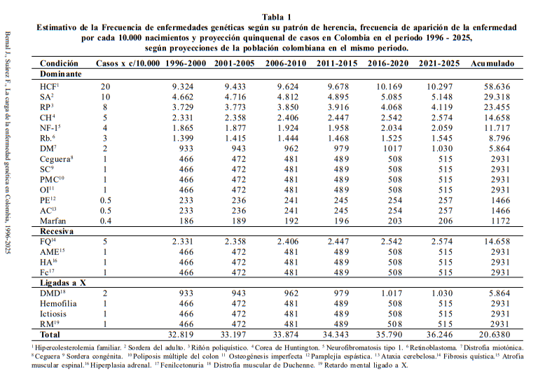
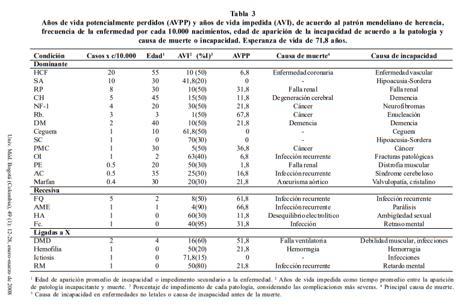

# Aplicación del Algoritmo Deutsch-Jozsa en el Diagnóstico Rápido de Enfermedades Genéticas en Colombia mediante Computación Cuántica

## Análisis del Problema

Colombia, con una población de 43,7 millones de habitantes y una esperanza de vida de 71,8 años, enfrenta desafíos en salud pública asociados a su transición epidemiológica. A pesar de ser clasificado como un país de ingreso medio-bajo por el Banco Mundial (PIB de US\$80.900 millones), ha logrado avances socioeconómicos y en salud en las últimas décadas, aunque persisten desigualdades [1, 2].

El mejoramiento en el control de infecciones y la atención materno-infantil ha hecho más visibles las enfermedades genéticas y malformaciones congénitas como causas de morbilidad y mortalidad [2]. Este estudio busca cuantificar su impacto mediante métricas como años de vida potencialmente perdidos (AVPP) y años de vida sana perdidos (AVISA), con el fin de orientar políticas públicas [1].  
Se analizaron datos demográficos del DANE [7] y registros de salud desde 1993 (tras la reforma al sistema de seguridad [3, 4]), proyectando tendencias hasta 2025 en periodos quinquenales [8]. Las limitaciones incluyen la inconsistencia de datos previos a 1990, enfocados históricamente en violencia y patologías endémicas [5, 6].

Los AVPP se calcularon comparando la expectativa de vida (71,8 años) con los años perdidos por discapacidad, ajustados por gravedad [10]. Para AVISA, se consideró tiempo perdido por muerte prematura y ponderación de incapacidades, aunque solo hay datos agregados para anomalías congénitas [9]. Las prevalencias y grados de discapacidad se basaron en la literatura especializada [11].  

### Enfermedades según patrón de herencia mendeliana, 1996-2025  
Teniendo en cuenta el patrón mendeliano de herencia de las patologías unigénicas y las enfermedades más representativas de cada patrón, se encuentra que las enfermedades, según sean dominantes, recesivas o ligadas a X, son patologías que tienen una alta prevalencia en la población colombiana y su número aumenta en cada quinquenio, considerando el periodo entre 1996 y 2025, tal como se aprecia en la tabla 1. Se describen las frecuencias de patologías de alto impacto, como la hipercolesterolemia familiar, la sordera congénita no sindrómica, la poliposis del colon y ciertas patologías neurológicas, como la enfermedad de Huntington, la fibrosis quística y las distrofias musculares.

  

### Enfermedades según anormalidades cromosómicas, 1996-2025  
Entre los trastornos cromosómicos, las aneuploidías autosómicas de mayor importancia son la trisomía 21, la trisomía 18 y la trisomía 13; entre los trastornos de cromosomas sexuales se destacan el síndrome de Turner y el síndrome de Klinefelter. Asimismo, las translocaciones autosómicas son los rearreglos estructurales más comunes observados en humanos. En la tabla 2 se aprecian las proyecciones de casos en el periodo 1996-2025.

  

### Años de vida impedida y años de vida potencialmente perdidos, 1996-2025  
Al analizar el promedio de edad en que se espera que las enfermedades inicien su sintomatología incapacitante, se observa que el promedio de edad para las enfermedades dominantes es mayor que el de las recesivas, las ligadas a X y las cromosómicas. Sin embargo, los años de vida impedida son similares entre las anomalías recesivas y dominantes, pero los años de vida potencialmente perdidos (AVPP) superan en la patología recesiva a los demás grupos. Teniendo en cuenta la fisiopatología de la enfermedad que define la edad de aparición de los principales síntomas y a la incapacidad producida junto a la causa de muerte en cada enfermedad, se construyeron las tablas 3 y 4 en las que se aprecian los años de vida potencialmente perdidos por patología (mendeliana y cromosómica), la principal causa de muerte y la principal causa de incapacidad, además del porcentaje de incapacidad secundario al desarrollo de la enfermedad.

  

 

  

---

## 2. Diferencial de la Tecnología -- ¿Por qué Computación Cuántica y el Algoritmo Deutsch-Jozsa?

El algoritmo Deutsch-Jozsa, desarrollado en los primeros años de la computación cuántica, resuelve un problema específico: determinar si una función booleana \( f(x) \) es **constante** o **balanceada**, con una sola evaluación cuántica, mientras que un algoritmo clásico requeriría evaluar hasta la mitad del dominio más uno en el peor de los casos.

Aunque este problema es artificial, el principio central ---el uso de **superposición cuántica y paralelismo masivo**--- representa una ventaja fundamental frente a métodos clásicos. En el contexto del análisis genético, donde una cadena de ADN puede representarse como una larga secuencia binaria (por ejemplo, utilizando codificación binaria de nucleótidos o patrones de expresión), este algoritmo puede adaptarse para:

- **Detectar patrones de mutación o anomalías** en una gran secuencia de datos con una mínima cantidad de consultas.
- **Reducir la complejidad computacional** del análisis de grandes cantidades de información genética.
- **Optimizar procesos de tamizaje genético** para enfermedades específicas en poblaciones amplias, sin necesidad de pruebas exhaustivas y costosas.

En un país como Colombia, donde los recursos tecnológicos en salud aún son desigualmente distribuidos, esta tecnología ---aunque hoy teórica--- representa una **oportunidad de salto tecnológico**, permitiendo que futuras herramientas diagnósticas se basen en principios de cómputo cuántico que podrían ejecutarse incluso en dispositivos compactos cuando esta tecnología se masifique.

El uso del **Deutsch-Jozsa** simboliza un cambio de paradigma: pasar de modelos secuenciales costosos a procesos ultrarrápidos capaces de explorar múltiples posibilidades al mismo tiempo. Esta eficiencia es **inalcanzable con computación clásica**, lo que justifica su inclusión como pilar tecnológico diferencial.

---

## 3. Relevancia y Contribución al Desarrollo Nacional

Colombia enfrenta retos estructurales en su sistema de salud: acceso limitado a tecnologías avanzadas en regiones apartadas, altos costos de pruebas genéticas, y escasez de profesionales capacitados en bioinformática o genética clínica.

Este proyecto propone introducir un **nuevo enfoque cuántico**, alineado con los planes del país en transformación digital y fortalecimiento del ecosistema de ciencia, tecnología e innovación. Su implementación teórica aportaría a:

- **Ampliar el acceso a pruebas de diagnóstico avanzado**, en especial si se desarrollan soluciones híbridas (cuántico-clásicas) que puedan incorporarse en laboratorios públicos y privados.
- **Reducir la carga económica sobre el sistema de salud**, al permitir un prediagnóstico más rápido y eficiente, optimizando el uso de recursos.
- **Fomentar el desarrollo científico local**, incentivando la formación de talento nacional en computación cuántica aplicada a la salud.
- **Estimular la colaboración entre universidades, centros de investigación y el sector salud**, impulsando una agenda interdisciplinaria y futurista.

Además, como Colombia hace parte de iniciativas regionales de tecnología avanzada, este tipo de propuestas posicionan al país como **referente latinoamericano** en la exploración de soluciones cuánticas para problemas sociales.

---

## 4. Resultados e Impactos Visualizados

### Resultados esperados (teóricos y de simulación):

- **Simulación funcional** de una versión del algoritmo Deutsch-Jozsa aplicado a una cadena binaria representando una secuencia genética.
- **Validación comparativa** contra algoritmos clásicos, mostrando la reducción significativa en evaluaciones necesarias para detectar un patrón.
- **Propuesta de arquitectura lógica** para un sistema diagnóstico que integre un backend cuántico simulado (IBM Qiskit) y una interfaz gráfica básica.
- **Producción de material académico y divulgativo**, como artículos, conferencias o prototipos didácticos, que sirvan como base para líneas de investigación futuras.

### Impactos esperados a diferentes niveles:

- **Corto plazo (1 año):**
  - Concientización académica sobre el uso de computación cuántica en medicina.
  - Interés de investigadores jóvenes en esta línea interdisciplinaria.
  - Generación de material educativo para universidades colombianas.

- **Mediano plazo (2 a 3 años):**
  - Desarrollo de prototipos en simuladores cuánticos y pruebas de concepto.
  - Articulación con redes nacionales de investigación para escalar la idea.
  - Inclusión en planes de investigación en salud e inteligencia artificial del país.

- **Largo plazo (5 años o más):**
  - Diseño de herramientas diagnósticas comerciales que usen principios cuánticos.
  - Posibilidad de diagnósticos genéticos rápidos en centros hospitalarios del país.
  - Reducción en la mortalidad o progresión de enfermedades genéticas por detección temprana.
